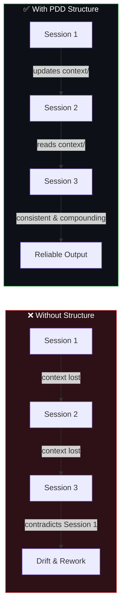
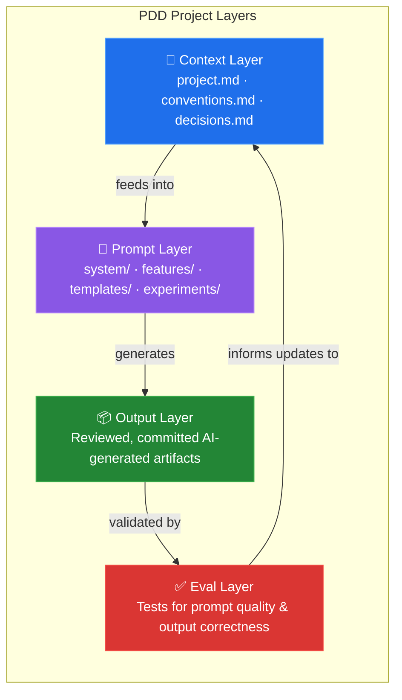
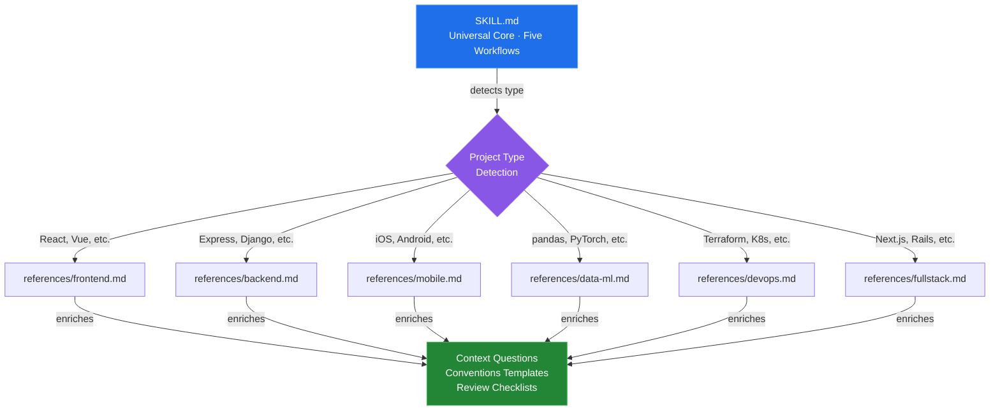
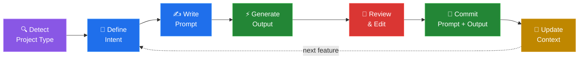
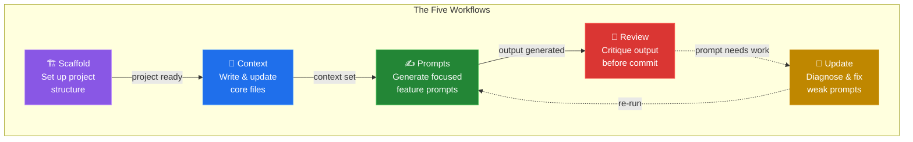

# Prompt Driven Development: A Practical Framework for Building with AI

There's a quiet shift happening in how software gets built. It's not just that developers are using AI tools — it's that the *act of prompting* is becoming a core part of the development workflow itself. Some are calling this Prompt Driven Development, or PDD. And if you're using AI tools daily without a clear structure around it, you're probably leaving a lot on the table.

This post lays out a practical framework for PDD: what it is, why structure matters, how to apply it whether you're starting fresh or integrating it into an existing project, and how to tailor it to your specific type of project. It draws on emerging writing from practitioners like Andrew Miller, Simon Willison, and teams at Microsoft and Capgemini who have been formalizing these ideas in the field.

We've also built and published a complete Claude skill for PDD — with project-type flavors for frontend, backend, mobile, data/ML, DevOps, and full-stack — available at [github.com/harshal2802/pdd-skill](https://github.com/harshal2802/pdd-skill).

---

## Installation

The PDD skill consists of the core skill definition (`SKILL.md`) plus domain-specific reference guides in `references/` that get loaded based on your project type. You need the full repository, not just a single file.

### Claude Code

**Option 1 — Clone into your project (recommended)**

```bash
# From your project root
git clone https://github.com/harshal2802/pdd-skill.git .claude/skills/pdd-skill
```

Then reference the skill in your `.claude/settings.json`:

```json
{
  "skills": [".claude/skills/pdd-skill/SKILL.md"]
}
```

**Option 2 — Clone standalone and reference globally**

```bash
git clone https://github.com/harshal2802/pdd-skill.git ~/pdd-skill
```

Add to your global settings (`~/.claude/settings.json`):

```json
{
  "skills": ["~/pdd-skill/SKILL.md"]
}
```

### GitHub Copilot

GitHub Copilot doesn't use the same skill system. To use PDD with Copilot:

1. Clone the repo into your project:
   ```bash
   git clone https://github.com/harshal2802/pdd-skill.git .pdd
   ```

2. Copy the core content into Copilot's custom instructions file:
   ```bash
   cp .pdd/SKILL.md .github/copilot-instructions.md
   ```

3. Reference the relevant reference guide for your project type in your prompts (e.g., `.pdd/references/frontend.md` for React projects).

### What's included

| Path | Purpose |
|---|---|
| `SKILL.md` | Core skill definition — five workflows, detection logic, prompt templates |
| `references/frontend.md` | Context questions, conventions, and review checklists for frontend/UI projects |
| `references/backend.md` | Same for backend/API projects |
| `references/mobile.md` | Same for mobile (iOS, Android, cross-platform) |
| `references/data-ml.md` | Same for data science and ML projects |
| `references/devops.md` | Same for DevOps and infrastructure |
| `references/fullstack.md` | Same for full-stack projects (also loads frontend + backend refs) |
| `examples/` | Complete PDD example for a Task Management API |

---

## What is Prompt Driven Development?

PDD is a development approach where prompts — instructions given to AI models — are treated as first-class artifacts, not throwaway inputs. Andrew Miller, one of the earliest writers to formalize the term, describes it as a workflow where the developer is primarily prompting an LLM to generate all necessary code, with the developer reviewing changes rather than writing code themselves. Just as traditional development has source code, tests, and documentation, PDD has a structured set of prompts, context files, and outputs that together define how a project is built.

The key mental shift: **your prompts are the source of truth**, not just a means to an end.

Microsoft's developer content team puts it similarly: prompts should be saved, documented, and versioned to capture architectural intent — just like code or design documents.

This matters because without structure, AI-assisted development tends to drift. You end up re-explaining the same context in every session, regenerating code that contradicts earlier decisions, and losing the reasoning behind why things were built a certain way. PDD solves this by making context explicit and persistent.

---

## Why Structure Matters

A common trap with AI tools is treating them like a smarter autocomplete. You type a vague request, get something plausible-looking, copy it in, and move on. This works fine for one-off tasks — but it doesn't scale.



Here's what happens without structure:

**Context drift**: Every new session starts cold. The AI doesn't know your stack, your conventions, or what you built last week.

**Decision amnesia**: You make an architectural call in conversation, it never gets written down, and three weeks later the AI (or a teammate) proposes something that contradicts it.

**Opaque outputs**: Code generated without documented intent is hard to debug, harder to hand off, and hardest to extend.

Structure doesn't slow you down. It's what lets PDD compound over time instead of creating a sprawling mess.

---

## The Project Structure

Here's the folder structure that works well for a PDD project:

```
my-project/
├── prompts/
│   ├── system/          # Persistent system prompts and constraints
│   ├── features/        # Feature-specific prompt chains
│   ├── templates/       # Reusable prompt patterns
│   └── experiments/     # Exploratory, time-boxed prompts
├── context/
│   ├── project.md       # What you're building, why, and with what stack
│   ├── conventions.md   # Code style, naming, patterns the AI should follow
│   └── decisions.md     # Architecture decisions and the reasoning behind them
├── outputs/             # Reviewed, committed AI-generated artifacts
├── evals/               # Tests for prompt quality and output correctness
└── README.md
```



The four layers each serve a distinct purpose:

**Context layer** is what the AI always needs to know. Think of it as the permanent briefing you'd give a new contractor on day one. It gets prepended to every significant prompt session.

**Prompt layer** is the actual instructions — kept modular and single-purpose. A prompt that tries to do five things produces worse results than five focused prompts chained together.

**Output layer** is where reviewed, accepted AI-generated code or content lives. Nothing goes here without being read and understood.

**Eval layer** is how you know your prompts are still working. Even simple checklists beat nothing.

---

## Project Type Flavors

The core PDD structure is universal — it works for any kind of project. But where projects genuinely differ is in the *content* of those files and the *criteria* for good output.

A React app and a Python data pipeline both need a `project.md` and versioned prompts. What changes is what goes inside them. Here's how the concerns differ by project type:

**Frontend / UI** needs context around design systems, component naming, accessibility standards, and state management. The review checklist looks for missing key props, ARIA labels, and unnecessary re-renders — not N+1 queries.

**Backend / API** needs conventions around schema design, auth patterns, error handling, and parameterized queries. Security surface area is the top review priority.

**Mobile** adds platform constraints (iOS vs Android), offline-first thinking, permission rationale, and app store readiness. A review without checking keyboard avoidance and safe area handling isn't a real review.

**Data / ML** needs context about dataset provenance, model selection rationale, evaluation metrics, and pipeline idempotency. "Good output" means something entirely different here — reproducibility and no silent data loss are the baseline.

**DevOps / Infrastructure** needs IaC conventions, blast radius thinking, secret management, and change safety. Every review should ask: what's the worst case if this runs twice?

**Full-stack** combines frontend and backend concerns, plus one that's unique to this category: the strict client/server boundary. Server-only code must never leak into client components, and auth must be enforced at the server level regardless of what the client says.

### How it's organized

The skill handles this cleanly without requiring separate tools for each project type. The core `SKILL.md` detects the project type — either from the tech stack in `context/project.md`, from what the user says, or by asking — and then loads the appropriate reference file:



Each reference file enriches three things: the context file questions and templates, the conventions starter content, and the review checklist — all tailored to that project type.

---

## The Core Workflow

For any given feature or task, the loop looks like this:



The last step is the one most people skip — and it's the most important. Keeping your context layer current is what separates PDD that scales from PDD that quietly regresses.

---

## Starting a Fresh Project

**Before writing a single prompt**, set up the skeleton:

```bash
mkdir my-project && cd my-project
git init
mkdir -p prompts/{system,features,templates,experiments} context outputs evals
touch context/project.md context/conventions.md context/decisions.md README.md
```

Then invest 30 minutes writing `context/project.md`. Answer these questions:
- What are we building and why?
- What's the tech stack and why those choices?
- What does good output look like here?
- What should the AI never do or suggest?

If you're using VS Code with Copilot or Cline, Capgemini's engineering team notes that `.github/copilot-instructions.md` and `.clinerules` serve the same purpose as `context/project.md` — and are automatically loaded by those tools, so lean into their native conventions.

Follow that with a lean `context/conventions.md` — even 10 lines covering naming, file structure, and error handling. You'll grow it over time.

From there, for each new feature: write a prompt in `prompts/features/`, run it, review the output, and commit both. If you made any architectural decision in the process, capture it in `context/decisions.md`.

**The ongoing discipline**: every session starts by asking — *is my context still current?* If the project has evolved, update `project.md` first.

---

## Integrating Into an Existing Project

Retrofitting PDD is trickier, but very doable if you resist doing it all at once.

```mermaid
gantt
    title PDD Integration Timeline
    dateFormat  X
    axisFormat Week %s

    section Week 1
    Observe & log prompts           :active, w1a, 0, 1
    Note what context you re-explain :active, w1b, 0, 1

    section Week 2
    Write context/project.md        :w2a, 1, 2
    Write context/decisions.md      :w2b, 1, 2
    Harvest best past prompts       :w2c, 1, 2

    section Week 3+
    Full workflow on new features    :w3a, 2, 4
    Grow conventions over time      :w3b, 2, 4
```



**Week 1 — observe before changing**

Run your normal workflow, but log: what did you ask the AI to do, which prompts produced good results, where did you have to heavily edit output, and what context did you find yourself re-explaining repeatedly. This log tells you what to systematize first.

**Week 2 — build the context layer**

Write `context/project.md` describing the project *as it currently is*, not as you wish it were. Then write `context/decisions.md` retroactively — capturing the big decisions already made. This prevents the AI from proposing alternatives to settled questions.

Also harvest your best past prompts. Dig through recent sessions and pull out the ones that worked well. Even a small library of 5–10 good prompts has compounding value.

**Week 3 onward — apply the full workflow to new work only**

Don't try to PDD-ify your entire existing codebase. Apply the full workflow — prompt → review → commit both — only to new features and significant changes. The existing codebase lives in `outputs/` as-is.

---

## The Five Workflows

The PDD skill covers five distinct situations you'll encounter in practice:



**Scaffold** sets up the folder structure for a new project — with OS-aware commands (Mac, Linux, Windows, and a no-CLI option for non-technical users).

**Context** writes or updates your three core files. The key discipline: write what is true, not what you hope will be true. An aspirational `project.md` actively misleads future prompts.

**Prompts** generates focused, context-aware feature prompts. The single-job rule is non-negotiable: if a task covers two distinct concerns, split it into two prompts before writing either one.

**Update** diagnoses and improves prompts that aren't working. The most common culprits: missing context, buried constraints, and ambiguous task descriptions that produce drifting output across runs.

**Review** critiques AI-generated output before it gets committed. This workflow treats output like a PR — four dimensions: correctness, fit with project context, maintainability, and what the output reveals about the prompt that produced it. Plus a project-type-specific checklist loaded from the reference file.

---

## Rules of Thumb

**One prompt, one job.** Decompose aggressively before prompting. A focused prompt is easier to debug, easier to improve, and easier to reuse.

**Version your prompts.** A prompt that worked last week may not work after a model update or context shift. Commit them alongside your code.

**Document intent, not just output.** For each significant generation, note *why* you prompted it that way. Future you (and future teammates) will thank you.

**Timebox experiments.** Exploratory prompts go in `/experiments` with a date. If they don't graduate to `/features` within a week, delete them. Don't let your prompts folder become a junk drawer.

**Never treat raw output as done.** Review AI-generated code like you'd review a PR. Simon Willison, writing about what he calls "vibe engineering," puts it plainly: he won't commit any code he couldn't explain to someone else.

**Use context config files your tools already support.** Tools like GitHub Copilot and Cline have built-in support for project-level context files that serve the same purpose as `context/project.md`. If you're using those tools, lean into their native conventions.

---

## The Biggest Mistake to Avoid

Building a long, tangled single conversation and treating it as your project. Context windows end. Models get updated. Teammates can't see your chat history.

Anything important that emerges in a session — a decision, a pattern that worked, a constraint you discovered — needs to be extracted into your `context/` or `prompts/` directories before the session ends. Otherwise it's gone.

---

## Examples

Want to see PDD in action? The [examples/](examples/) directory contains a complete, realistic PDD setup for a Task Management API — including filled-in context files, structured feature prompts, a prompt chain, and an eval checklist.

| Example | What it shows |
|---|---|
| [context/project.md](examples/task-management-api/context/project.md) | A filled-in project context file |
| [context/conventions.md](examples/task-management-api/context/conventions.md) | Coding standards the AI must follow |
| [context/decisions.md](examples/task-management-api/context/decisions.md) | Architecture decisions with rationale |
| [create-task-endpoint.md](examples/task-management-api/prompts/features/create-task-endpoint.md) | A standalone feature prompt |
| [task-filtering-01-schema.md](examples/task-management-api/prompts/features/task-filtering-01-schema.md) | Prompt chain (step 1 of 2) |
| [task-filtering-02-api.md](examples/task-management-api/prompts/features/task-filtering-02-api.md) | Prompt chain (step 2 of 2) |
| [create-task-endpoint-eval.md](examples/task-management-api/evals/create-task-endpoint-eval.md) | Eval checklist for verifying output |

---

## The Skill

Everything described in this post is codified in a Claude skill published at [github.com/harshal2802/pdd-skill](https://github.com/harshal2802/pdd-skill).

The skill handles all five workflows, detects your project type automatically, and loads the right reference file to enrich every response — context questions, conventions templates, and review checklists tailored to your stack. It works for solo developers and teams, technical and non-technical users, and both fresh and existing projects.

---

## Closing Thought

PDD isn't magic, and it won't replace engineering judgment. What it does is give that judgment a structured interface to work through. The developers who get the most out of it are the ones who use it to move faster on things they already understand — not to skip understanding entirely.

The analogy that keeps coming to mind: calculators didn't make math literacy less important. They raised the stakes for knowing *when* and *what* to calculate.

The same applies here. The better your prompts, context, and review discipline — the better the AI works for you.

---

*Have a structure that's working differently for your team? I'd love to hear how you've adapted it.*

---

## Further Reading

The PDD space is evolving quickly. Here's the best of what's out there right now:

**Foundational PDD**
- [Andrew Miller — "Prompt Driven Development"](https://andrewships.substack.com/p/prompt-driven-development) — The original formalization of the term and workflow *(Jan 2025)*
- [VS Code / DEV Community — "Introduction to Prompt Driven Development"](https://dev.to/azure/introduction-to-prompt-driven-development-36b0) — Microsoft's formal series on PDD as an engineering practice *(Jan 2026)*
- [Capgemini Engineering — "Prompt Driven Development"](https://capgemini.github.io/ai/prompt-driven-development/) — A practitioner's account building real projects with Cline and V0 *(May 2025)*
- [Chris Perrin — "Prompt Driven Development: What We Were Really Doing All Along"](https://medium.com/@CommonDialog/prompt-driven-development-what-we-were-really-doing-all-along-accidentally-790528287705) — A reflective piece on why prompting must become a first-class citizen *(Jan 2026)*

**Related Thinking**
- [Simon Willison — "Vibe Engineering"](https://simonwillison.net/2025/Oct/7/vibe-engineering/) — The case for responsible AI-assisted development with real engineering discipline *(Oct 2025)*
- [Simon Willison — "Agentic Engineering Patterns"](https://simonw.substack.com/p/agentic-engineering-patterns) — How PDD evolves when the AI can also execute and iterate autonomously *(Feb 2026)*
- [Hexaware — "PromptOps"](https://hexaware.com/blogs/prompt-driven-development-coding-in-conversation/) — Scaling PDD across teams with prompt registries and versioning infrastructure *(2025)*

**Academic**
- [MDPI Electronics — Empirical Study on PDD](https://www.mdpi.com/2079-9292/15/4/903) — Peer-reviewed research building a full framework using only prompts, no manually written code *(March 2026)*

**The Skill**
- [github.com/harshal2802/pdd-skill](https://github.com/harshal2802/pdd-skill) — Claude skill with project-type flavors for frontend, backend, mobile, data/ML, DevOps, and full-stack