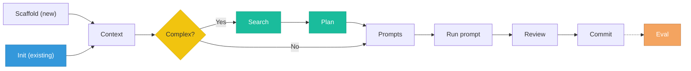

# Prompt Driven Development (PDD) Skill

A Claude Code skill for structuring AI-assisted development with versioned prompts, persistent context, and structured review.

PDD treats prompts as first-class artifacts — not throwaway inputs. This skill gives Claude nine workflows: **scaffold** a new project structure or **init** PDD in an existing project, write **context** files, **search** for existing solutions, **plan** implementation before coding, generate feature **prompts**, **update** failing prompts, **review** AI-generated output (with automated quality checks), and **evaluate** prompt reliability over time.

For simple features, you only need **Context → Prompts → Review**. Search, Plan, and Eval add value for complex or critical features but are not required.

## Installation

### Claude Code

**Plugin install (recommended):**

Run these commands inside Claude Code (not your terminal):

```
/plugin marketplace add harshal2802/pdd-skill
/plugin install pdd-skill
```

The plugin system auto-discovers the skill and commands. No manual config needed.

**Manual install:**

```bash
git clone https://github.com/harshal2802/pdd-skill.git .claude/skills/pdd-skill
```

Then add the skill to `.claude/settings.json` (create the file if it doesn't exist):

```json
{
  "skills": [".claude/skills/pdd-skill/skills/pdd/SKILL.md"]
}
```

> **Tip:** To pin a specific version, add `--branch v1.3.0` to the clone command. To install globally instead of per-project, clone to `~/pdd-skill` and reference it in `~/.claude/settings.json`.

### GitHub Copilot

PDD is also available for GitHub Copilot Chat. See [`copilot/README.md`](copilot/) for setup instructions — it uses a separate set of prompt files with the same nine workflows.

## Project Structure

A PDD project looks like this:

```
my-project/
├── pdd/
│   ├── prompts/
│   │   ├── features/        # Prompt files grouped by area (e.g., features/auth/, features/tasks/)
│   │   │   ├── auth/        #   One subfolder per feature domain, app module, or tool
│   │   │   └── tasks/
│   │   ├── templates/       # Reusable prompt patterns
│   │   └── experiments/     # Exploratory, time-boxed prompts
│   ├── context/
│   │   ├── project.md       # What you're building, why, and with what stack
│   │   ├── conventions.md   # Code style, naming, patterns the AI should follow
│   │   └── decisions.md     # Architecture decisions and the reasoning behind them
│   └── evals/               # Tests for prompt quality and output correctness
│       ├── baselines/       # Known-good outputs for diff comparison
│       └── scripts/         # Automated validation scripts
├── src/                     # Reviewed, committed AI-generated artifacts (or user-chosen name)
└── ...
```

## Slash Commands

PDD includes slash commands for Claude Code. If you installed via plugin, they're available automatically. For manual installs, copy them into your project:

```bash
# Only needed for manual installs
cp -r .claude/skills/pdd-skill/commands/* .claude/commands/
```

Invoke them in Claude Code:

| Command | What it does |
|---|---|
| `/project:pdd-scaffold` | Set up a new PDD project with folders, context stubs, and git init |
| `/project:pdd-init` | Add PDD to an existing project — auto-detects stack and conventions |
| `/project:pdd-context` | Write or update `pdd/context/project.md`, `conventions.md`, and `decisions.md` |
| `/project:pdd-search` | Search for existing solutions before building custom features |
| `/project:pdd-plan` | Create an implementation plan before writing prompts |
| `/project:pdd-prompts` | Generate a focused feature prompt (standalone or chained) |
| `/project:pdd-update` | Diagnose and fix a prompt that isn't producing good results |
| `/project:pdd-review` | Verify and review AI-generated output before committing |
| `/project:pdd-eval` | Run prompt evaluations and track pass rates over time |
| `/project:pdd-status` | Health check — shows what's set up, what's missing, and what's stale |
| `/project:pdd-help` | Quick reference — lists all commands, workflow order, and usage guidance |

All commands accept optional arguments, e.g., `/project:pdd-scaffold my-api` or `/project:pdd-review paste your code here`.

## Workflow



**Quick path**: Context → Prompts → Review → commit. Use **Init** instead of Scaffold for existing projects. Add Search and Plan for complex features. Eval is optional for tracking prompt reliability.

Unlike Copilot where you invoke each step manually, Claude Code **auto-triggers** the right workflow based on what you say. After each step, it suggests the natural next one:

```
You:    "Help me add authentication to my API"
Claude: detects → Search workflow (checks for existing auth libraries)
        → suggests Plan (feature spans schema + middleware + routes)
        → walks through Prompts for each phase
        → runs Review (verify + review) on generated code
        → suggests Eval after commit
```

You can also jump directly to any workflow with slash commands, or let the skill route you automatically.

## What's Included

| Path | Purpose |
|---|---|
| `skills/pdd/SKILL.md` | Core skill definition — nine workflows, project type detection, prompt templates |
| `.claude-plugin/plugin.json` | Plugin manifest for distribution via the Claude Code plugin system |
| `hooks/` | Optional session-start hook for context freshness checks |
| `references/frontend.md` | Context questions, conventions, and review checklists for frontend/UI projects |
| `references/backend.md` | Same for backend/API projects |
| `references/mobile.md` | Same for mobile (iOS, Android, cross-platform) |
| `references/data-ml.md` | Same for data science and ML projects |
| `references/devops.md` | Same for DevOps and infrastructure |
| `references/fullstack.md` | Same for full-stack projects (also loads frontend + backend refs) |
| `references/library.md` | Same for library / installable package projects (composable with domain flavors) |
| `references/cli-devtools.md` | Same for CLI and developer tools (argument parsing, exit codes, signal handling) |
| `references/embedded-iot.md` | Same for embedded systems and IoT projects (memory constraints, real-time, cross-compilation) |
| `references/game-dev.md` | Same for game development projects (frame budgets, ECS, asset pipelines, platform certification) |
| `references/blockchain.md` | Same for blockchain / smart contract projects (security patterns, gas optimization, upgradeability, audit readiness) |
| `references/security.md` | Same for security / pentesting tool projects (detection quality, safe defaults, false positive management, SIEM integration) |
| `references/api-platform.md` | Same for API platform / SDK projects (backward compatibility, SDK generation, error design, rate limiting, webhooks) |
| `references/desktop-gui.md` | Same for desktop / native GUI projects (window management, OS integration, code signing, auto-updates, cross-platform) |
| `references/compiler-lang.md` | Same for compiler / language tooling projects (parsing, AST design, type systems, error recovery, LSP integration) |
| `references/robotics.md` | Same for robotics / ROS projects (real-time control, sensor fusion, simulation-first, safety systems, coordinate frames) |
| `commands/` | Eleven Claude Code slash commands for each workflow + status check + help |
| `examples/` | Complete PDD example for a Task Management API |

The skill auto-detects your project type and loads the right reference file to enrich context questions, conventions, and review checklists.

## Example

See [`examples/task-management-api/`](examples/task-management-api/) for a complete PDD setup with filled-in context files, standalone and chained feature prompts, and an eval checklist.

## Migrating from the old layout

If you have an existing PDD project using the old layout (with `prompts/`, `context/`, `evals/` at the project root), see [`docs/migration.md`](docs/migration.md) for step-by-step migration instructions.

## Learn More

- **[Philosophy](docs/philosophy.md)** — Why PDD exists, the four layers, project type flavors, and how to get started
- **[Efficiency Tips](docs/efficiency-tips.md)** — Practical habits for reducing token usage and cost
- **[Migration Guide](docs/migration.md)** — Moving from the old layout to the `pdd/` structure

## License

MIT
