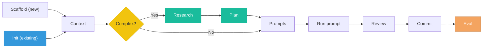

# Prompt Driven Development (PDD) Skill

A multi-provider Prompt Driven Development toolkit for structuring AI-assisted development with versioned prompts, persistent context, and structured review.

PDD treats prompts as first-class artifacts, not throwaway inputs. This repo currently packages the same core PDD system for Claude Code, GitHub Copilot, Codex, and Google Antigravity. The core workflows are **scaffold**, **init**, **context**, **research**, **plan**, **prompts**, **update**, **review**, **eval**, plus the `status` and `help` utility workflows.

For simple features, you only need **Context → Prompts → Review**. Research, Plan, and Eval add value for complex or critical features but are not required.

## Installation

PDD is packaged for three surfaces from the same shared core:

| Provider | Adapter | Notes |
|---|---|---|
| Claude Code | `providers/claude/` | Claude skill, slash commands, hooks, and plugin metadata |
| GitHub Copilot | `providers/copilot/` | Copilot prompts plus always-on instructions |
| Codex | `providers/codex/` | Codex plugin and `pdd` skill adapter |
| Google Antigravity | `providers/antigravity/` | Antigravity skill, workflows, and `GEMINI.md` workspace rules |

### Claude Code

**Plugin install (recommended):**

Run these commands inside Claude Code (not your terminal):

```
/plugin marketplace add harshal2802/pdd-skill
/plugin install pdd-skill
```

The plugin system auto-discovers the skill and commands. No manual config needed.

**Manual install:**

```bash
git clone https://github.com/harshal2802/pdd-skill.git .claude/skills/pdd-skill
```

Then add the skill to `.claude/settings.json` (create the file if it doesn't exist):

```json
{
  "skills": [".claude/skills/pdd-skill/providers/claude/skills/pdd/SKILL.md"]
}
```

> **Tip:** To pin a specific version, add `--branch v1.5.0` to the clone command. To install globally instead of per-project, clone to `~/pdd-skill` and reference it in `~/.claude/settings.json`.

### GitHub Copilot

Clone the repo, then copy these files into your project:

```bash
git clone https://github.com/harshal2802/pdd-skill.git /tmp/pdd-skill

# Copy the always-on instructions
cp /tmp/pdd-skill/providers/copilot/copilot-instructions.md <your-project>/.github/copilot-instructions.md

# Copy the prompt files
cp -r /tmp/pdd-skill/providers/copilot/prompts/ <your-project>/.github/prompts/

# Copy the reference files (project type flavors)
cp -r /tmp/pdd-skill/core/references/ <your-project>/.github/references/
```

In VS Code Copilot Chat, type `/` to see the available PDD prompt files (e.g. `/pdd-scaffold`, `/pdd-context`). Requires VS Code 1.93+ with Copilot Chat prompt file support.

See [`providers/copilot/README.md`](providers/copilot/README.md) for the full workflow list and usage details.

### Codex

Clone the repo into your project as a local plugin:

```bash
git clone https://github.com/harshal2802/pdd-skill.git /tmp/pdd-skill

# Copy the plugin into your project
cp -r /tmp/pdd-skill/plugins/pdd-skill <your-project>/.codex/plugins/pdd-skill

# Or use the repo-local marketplace entry
cp /tmp/pdd-skill/.agents/plugins/marketplace.json <your-project>/.agents/plugins/marketplace.json
```

The `pdd` skill exposes all workflows (e.g. `pdd:scaffold`, `pdd:context`, `pdd:review`).

See [`providers/codex/README.md`](providers/codex/README.md) for layout details and the full command table.

### Google Antigravity

Clone the repo, then copy these files into your project:

```bash
git clone https://github.com/harshal2802/pdd-skill.git /tmp/pdd-skill

# Copy the workspace rules
cp /tmp/pdd-skill/providers/antigravity/GEMINI.md <your-project>/GEMINI.md

# Copy the skill entrypoint
mkdir -p <your-project>/.agents/skills/pdd
cp /tmp/pdd-skill/providers/antigravity/skills/pdd/SKILL.md <your-project>/.agents/skills/pdd/SKILL.md

# Copy the workflow files
mkdir -p <your-project>/.agent/workflows
cp /tmp/pdd-skill/providers/antigravity/workflows/*.md <your-project>/.agent/workflows/

# Copy the reference files (project type flavors)
mkdir -p <your-project>/.agent/references
cp -r /tmp/pdd-skill/core/references/* <your-project>/.agent/references/
```

In Antigravity, the workflow files auto-expose as slash commands (e.g. `/pdd-scaffold`, `/pdd-context`). `GEMINI.md` is used instead of the cross-tool-standard `AGENTS.md` so installing alongside Codex or Cursor does not produce a rules-file collision.

See [`providers/antigravity/README.md`](providers/antigravity/README.md) for layout details and the full command table.

## Repo Structure

The repo is now organized into a shared core plus thin provider adapters:

```text
pdd-skill/
├── core/
│   ├── workflows/          # Provider-agnostic workflow definitions
│   ├── references/         # Shared project-type references
│   ├── examples/           # Shared example PDD projects
│   └── metadata/           # Workflow + provider metadata
├── providers/
│   ├── claude/             # Claude Code skill, commands, hooks, plugin metadata
│   ├── copilot/            # Copilot prompt files + always-on instructions
│   └── codex/              # Codex plugin + skill adapter
├── plugins/
│   └── pdd-skill           # Codex plugin compatibility path
└── .agents/plugins/        # Codex repo-local marketplace metadata
```

The `.claude-plugin` symlink at the root is required by the Claude plugin system. The `plugins/pdd-skill` path is required by the Codex marketplace. All other top-level compatibility symlinks have been removed — use `core/` and `providers/` paths directly. See [`docs/architecture.md`](docs/architecture.md) for details.

## Maintenance

Shared PDD behavior now lives under `core/metadata/` and `core/workflows/`, while provider wrappers under `providers/` contain generated sections where duplication was previously highest.

When changing shared behavior:

```bash
python3 scripts/render_workflow_tables.py
bash tests/consistency.sh
bash tests/test-hooks.sh
```

See [`docs/maintenance.md`](docs/maintenance.md) for the full maintenance workflow and [`docs/final-architecture-review.md`](docs/final-architecture-review.md) for the final source-of-truth boundaries.

## Project Structure

A PDD project looks like this:

```
my-project/
├── pdd/
│   ├── prompts/
│   │   ├── features/        # Prompt files grouped by area (e.g., features/auth/, features/tasks/)
│   │   │   ├── auth/        #   One subfolder per feature domain, app module, or tool
│   │   │   └── tasks/
│   │   ├── templates/       # Reusable prompt patterns
│   │   └── experiments/     # Exploratory, time-boxed prompts
│   ├── context/
│   │   ├── project.md       # What you're building, why, and with what stack
│   │   ├── conventions.md   # Code style, naming, patterns the AI should follow
│   │   └── decisions.md     # Architecture decisions and the reasoning behind them
│   └── evals/               # Tests for prompt quality and output correctness
│       ├── baselines/       # Known-good outputs for diff comparison
│       └── scripts/         # Automated validation scripts
├── src/                     # Reviewed, committed AI-generated artifacts (or user-chosen name)
└── ...
```

## Slash Commands

PDD includes slash commands for Claude Code. If you installed via plugin, they're available automatically. For manual installs, copy them into your project:

```bash
# Only needed for manual installs
cp -r .claude/skills/pdd-skill/providers/claude/commands/* .claude/commands/
```

Invoke them in Claude Code:

<!-- GENERATED:claude-command-table:start -->
| Command | What it does |
|---|---|
| `/project:pdd-scaffold` | Set up a new PDD project with folders, context stubs, and starter guidance. |
| `/project:pdd-init` | Add PDD structure to an existing repository and infer a starting context. |
| `/project:pdd-context` | Write or update the persistent project context files that future prompts depend on. |
| `/project:pdd-research` | Explore the problem space, evaluate options, and decide what to build. |
| `/project:pdd-plan` | Break a feature into phases and decide the prompt chain strategy before coding. |
| `/project:pdd-prompts` | Generate focused feature prompts and place them in the right PDD folder. |
| `/project:pdd-update` | Diagnose and improve a prompt that is producing weak or incorrect output. |
| `/project:pdd-review` | Verify and review AI-generated output before it is committed. |
| `/project:pdd-eval` | Track prompt quality over time with repeatable evaluation criteria. |
| `/project:pdd-status` | Check what PDD artifacts exist, what is stale, and what to do next. |
| `/project:pdd-help` | Show the available workflows, when to use them, and the typical sequence. |
<!-- GENERATED:claude-command-table:end -->

All commands accept optional arguments, e.g., `/project:pdd-scaffold my-api` or `/project:pdd-review paste your code here`.

In Antigravity (workflow files auto-expose as `/`-prefixed slash commands):

<!-- GENERATED:antigravity-command-table:start -->
| Command | What it does |
|---|---|
| `/pdd-scaffold` | Set up a new PDD project with folders, context stubs, and starter guidance. |
| `/pdd-init` | Add PDD structure to an existing repository and infer a starting context. |
| `/pdd-context` | Write or update the persistent project context files that future prompts depend on. |
| `/pdd-research` | Explore the problem space, evaluate options, and decide what to build. |
| `/pdd-plan` | Break a feature into phases and decide the prompt chain strategy before coding. |
| `/pdd-prompts` | Generate focused feature prompts and place them in the right PDD folder. |
| `/pdd-update` | Diagnose and improve a prompt that is producing weak or incorrect output. |
| `/pdd-review` | Verify and review AI-generated output before it is committed. |
| `/pdd-eval` | Track prompt quality over time with repeatable evaluation criteria. |
| `/pdd-status` | Check what PDD artifacts exist, what is stale, and what to do next. |
| `/pdd-help` | Show the available workflows, when to use them, and the typical sequence. |
<!-- GENERATED:antigravity-command-table:end -->

## Workflow


```mermaid
flowchart LR
    A["Scaffold (new)"] --> B["Context"]
    A2["Init (existing)"] --> B
    B --> S{Complex?}
    S -- Yes --> C["Research"] --> D["Plan"] --> E
    S -- No --> E["Prompts"]
    E --> F["Run prompt"]
    F --> G["Review"]
    G --> H["Commit"]
    H -.-> I["Eval"]

    style A2 fill:#3498db,stroke:#2980b9,color:#fff
    style S fill:#f1c40f,stroke:#d4ac0d,color:#333
    style C fill:#1abc9c,stroke:#17a589,color:#fff
    style D fill:#1abc9c,stroke:#17a589,color:#fff
    style I fill:#f4a460,stroke:#c4824a,color:#fff
```

**Quick path**: Context → Prompts → Review → commit. Use **Init** instead of Scaffold for existing projects. Add Research and Plan for complex features. Eval is optional for tracking prompt reliability.

Unlike Copilot where you invoke each step manually, Claude Code **auto-triggers** the right workflow based on what you say. After each step, it suggests the natural next one:

```
You:    "Help me add authentication to my API"
Claude: detects → Research workflow (explores the problem, checks for existing auth libraries)
        → suggests Plan (feature spans schema + middleware + routes)
        → walks through Prompts for each phase
        → runs Review (verify + review) on generated code
        → suggests Eval after commit
```

You can also jump directly to any workflow with slash commands, or let the skill route you automatically.

## What's Included

| Path | Purpose |
|---|---|
| `core/workflows/` | Provider-agnostic workflow definitions shared across Claude, Copilot, and Codex |
| `core/references/` | Shared project-type references used to tailor context questions and review checklists |
| `core/examples/` | Complete example PDD projects |
| `core/metadata/workflows.json` | Structured workflow ids, labels, categories, and provider mappings |
| `providers/claude/skills/pdd/SKILL.md` | Claude Code entrypoint skill |
| `providers/claude/commands/` | Claude Code slash commands |
| `providers/claude/hooks/` | Optional Claude session-start hook |
| `providers/claude/plugin/plugin.json` | Claude plugin manifest |
| `providers/copilot/` | Copilot prompt files and always-on instructions |
| `providers/codex/plugin/.codex-plugin/plugin.json` | Codex plugin manifest |
| `.agents/plugins/marketplace.json` | Repo-local Codex marketplace entry for `plugins/pdd-skill` |

The skill auto-detects your project type and loads the right reference file to enrich context questions, conventions, and review checklists.

## Example

See [`core/examples/task-management-api/`](core/examples/task-management-api/) for a complete PDD setup with filled-in context files, standalone and chained feature prompts, and an eval checklist.

## Migrating from the old layout

If you have an existing PDD project using the old layout (with `prompts/`, `context/`, `evals/` at the project root), see [`docs/migration.md`](docs/migration.md) for step-by-step migration instructions.

## Learn More

- **[Philosophy](docs/philosophy.md)** — Why PDD exists, the four layers, project type flavors, and how to get started
- **[Efficiency Tips](docs/efficiency-tips.md)** — Practical habits for reducing token usage and cost
- **[Migration Guide](docs/migration.md)** — Moving from the old layout to the `pdd/` structure
- **[Architecture](docs/architecture.md)** — How the repo is organized for multiple providers
- **[Maintenance](docs/maintenance.md)** — How generated sections and shared metadata are maintained

## License

MIT
