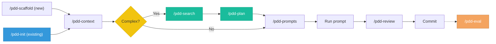

# PDD Skill for GitHub Copilot

The same Prompt Driven Development workflows, adapted for GitHub Copilot Chat in VS Code.

## Setup

Copy these files into your project:

```bash
# Copy the always-on instructions
cp copilot-instructions.md <your-project>/.github/copilot-instructions.md

# Copy the prompt files
cp -r prompts/ <your-project>/.github/prompts/

# Copy the reference files (project type flavors)
cp -r ../references/ <your-project>/.github/references/
```

Your project should end up with:

```
.github/
  copilot-instructions.md
  prompts/
    pdd-scaffold.prompt.md
    pdd-init.prompt.md
    pdd-context.prompt.md
    pdd-search.prompt.md
    pdd-plan.prompt.md
    pdd-prompts.prompt.md
    pdd-update.prompt.md
    pdd-review.prompt.md
    pdd-eval.prompt.md
    pdd-status.prompt.md
  references/
    frontend.md
    backend.md
    mobile.md
    data-ml.md
    devops.md
    fullstack.md
    library.md
    cli-devtools.md
    embedded-iot.md
    game-dev.md
    blockchain.md
    security.md
    api-platform.md
    desktop-gui.md
```

## Usage

In VS Code Copilot Chat, type `/` to see available prompt files, then select one:

| Command | What it does |
|---|---|
| `/pdd-scaffold` | Set up PDD folder structure for a new project |
| `/pdd-init` | Add PDD to an existing project — auto-detects stack and conventions |
| `/pdd-context` | Write or update context files (pdd/context/project.md, conventions.md, decisions.md) |
| `/pdd-search` | Search for existing solutions before building custom features |
| `/pdd-plan` | Create an implementation plan before writing prompts |
| `/pdd-prompts` | Generate a focused feature prompt |
| `/pdd-update` | Diagnose and fix a prompt that isn't working |
| `/pdd-review` | Verify and review AI-generated code before committing |
| `/pdd-eval` | Run prompt evaluations and track pass rates |
| `/pdd-status` | Health check — what's set up, what's missing, what's stale |

The `copilot-instructions.md` file loads automatically in every Copilot Chat session, providing PDD-aware routing and core principles.

## Workflow



**Quick path**: `/pdd-context` → `/pdd-prompts` → `/pdd-review` → commit. Use `/pdd-init` instead of `/pdd-scaffold` for existing projects. Add `/pdd-search` and `/pdd-plan` for complex features. Use `/pdd-eval` to track prompt reliability over time.

Each prompt file suggests the next step at the end, so you don't need to memorize the flow.

## Differences from the Claude Code version

| Aspect | Claude Code (SKILL.md) | Copilot (prompt files) |
|---|---|---|
| Activation | Auto-triggers on keywords | User invokes manually via `/` |
| Reference files | Loaded dynamically by type | Use `#file:` references in prompts |
| Workflow chaining | Built-in suggestions | Each file suggests the next step |
| Always-on context | Only when triggered | `copilot-instructions.md` is always loaded |

## Requirements

- VS Code with GitHub Copilot Chat extension
- Copilot Chat must have prompt file support enabled (VS Code 1.93+)
