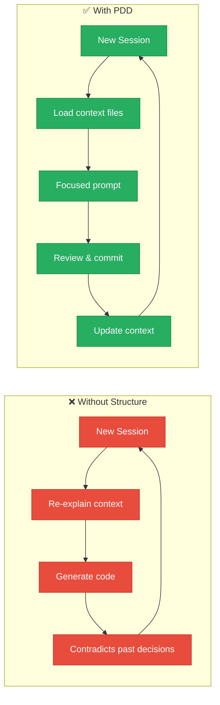
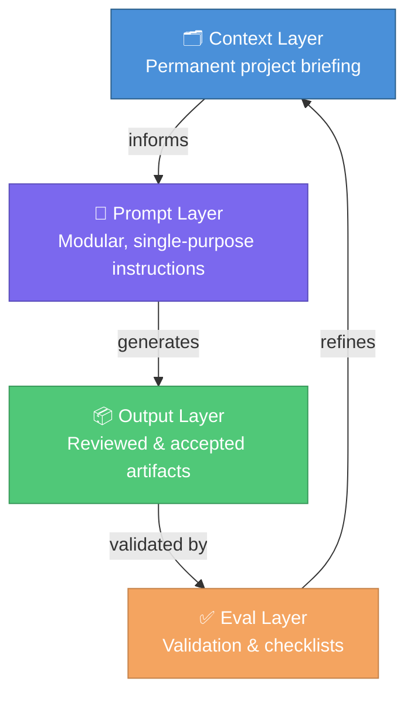
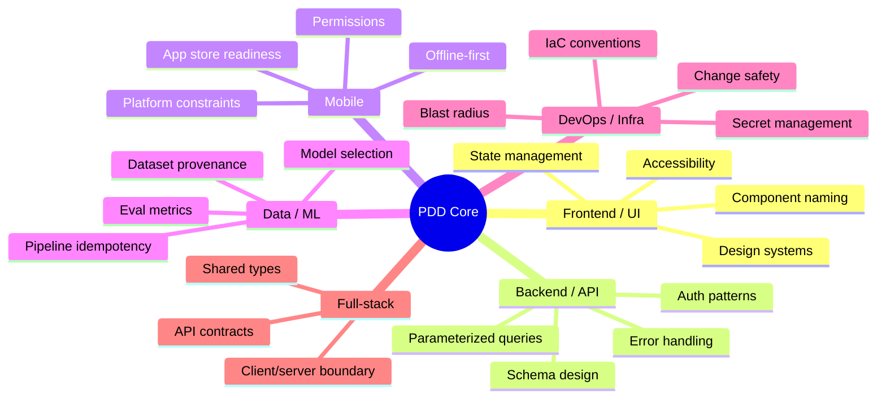
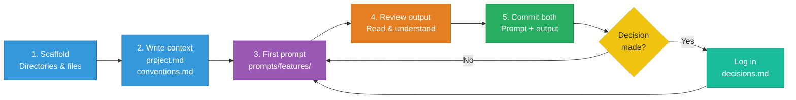

# Prompt Driven Development: The Philosophy

There's a quiet shift happening in how software gets built. It's not just that developers are using AI tools — it's that the *act of prompting* is becoming a core part of the development workflow itself. Some are calling this Prompt Driven Development, or PDD. And if you're using AI tools daily without a clear structure around it, you're probably leaving a lot on the table.

---

## What is Prompt Driven Development?

PDD is a development approach where prompts — instructions given to AI models — are treated as first-class artifacts, not throwaway inputs. Andrew Miller, one of the earliest writers to formalize the term, describes it as a workflow where the developer is primarily prompting an LLM to generate all necessary code, with the developer reviewing changes rather than writing code themselves. Just as traditional development has source code, tests, and documentation, PDD has a structured set of prompts, context files, and outputs that together define how a project is built.

The key mental shift: **your prompts are the source of truth**, not just a means to an end.

Microsoft's developer content team puts it similarly: prompts should be saved, documented, and versioned to capture architectural intent — just like code or design documents.

This matters because without structure, AI-assisted development tends to drift. You end up re-explaining the same context in every session, regenerating code that contradicts earlier decisions, and losing the reasoning behind why things were built a certain way. PDD solves this by making context explicit and persistent.

---

## Why Structure Matters

A common trap with AI tools is treating them like a smarter autocomplete. You type a vague request, get something plausible-looking, copy it in, and move on. This works fine for one-off tasks — but it doesn't scale.

Here's what happens without structure:



**Context drift**: Every new session starts cold. The AI doesn't know your stack, your conventions, or what you built last week.

**Decision amnesia**: You make an architectural call in conversation, it never gets written down, and three weeks later the AI (or a teammate) proposes something that contradicts it.

**Opaque outputs**: Code generated without documented intent is hard to debug, harder to hand off, and hardest to extend.

Structure doesn't slow you down. It's what lets PDD compound over time instead of creating a sprawling mess.

---

## The Four Layers



**Context layer** is what the AI always needs to know. Think of it as the permanent briefing you'd give a new contractor on day one. It gets prepended to every significant prompt session.

**Prompt layer** is the actual instructions — kept modular and single-purpose. A prompt that tries to do five things produces worse results than five focused prompts chained together.

**Output layer** is where reviewed, accepted AI-generated code or content lives. Nothing goes here without being read and understood.

**Eval layer** is how you know your prompts are still working. Even simple checklists beat nothing.

---

## Project Type Flavors

The core PDD structure is universal — it works for any kind of project. But where projects genuinely differ is in the *content* of those files and the *criteria* for good output.



A React app and a Python data pipeline both need a `project.md` and versioned prompts. What changes is what goes inside them.

---

## Starting a Fresh Project

**Before writing a single prompt**, set up the skeleton:

```bash
mkdir my-project && cd my-project
git init
mkdir -p prompts/{system,features,templates,experiments} context outputs evals
touch context/project.md context/conventions.md context/decisions.md README.md
```



Then invest 30 minutes writing `context/project.md`. Answer these questions:
- What are we building and why?
- What's the tech stack and why those choices?
- What does good output look like here?
- What should the AI never do or suggest?

Follow that with a lean `context/conventions.md` — even 10 lines covering naming, file structure, and error handling. You'll grow it over time.

For each new feature: write a prompt in `prompts/features/`, run it, review the output, and commit both. If you made any architectural decision in the process, capture it in `context/decisions.md`.

**The ongoing discipline**: every session starts by asking — *is my context still current?*

---

## Integrating Into an Existing Project

Retrofitting PDD is trickier, but very doable if you resist doing it all at once.

```mermaid
gantt
    title PDD Adoption Timeline
    dateFormat X
    axisFormat Week %s

    section Observe
        Log prompts & pain points           :active, w1, 1, 2

    section Build Context
        Write project.md & decisions.md     :w2, 2, 3

    section Apply
        PDD on new features only            :w3, 3, 5
```



**Week 1 — observe before changing**: Run your normal workflow, but log what you ask the AI, which prompts work well, and what context you re-explain repeatedly.

**Week 2 — build the context layer**: Write `context/project.md` describing the project *as it currently is*. Then write `context/decisions.md` retroactively — capturing the big decisions already made.

**Week 3 onward — apply the full workflow to new work only**: Don't PDD-ify your entire existing codebase. Apply the full workflow only to new features and significant changes.

---

## Rules of Thumb

**One prompt, one job.** Decompose aggressively before prompting.

**Version your prompts.** A prompt that worked last week may not work after a model update.

**Document intent, not just output.** Note *why* you prompted it that way.

**Timebox experiments.** Exploratory prompts go in `/experiments` with a date. If they don't graduate within a week, delete them.

**Never treat raw output as done.** Review AI-generated code like you'd review a PR.

---

## The Biggest Mistake to Avoid

Building a long, tangled single conversation and treating it as your project. Context windows end. Models get updated. Teammates can't see your chat history.

Anything important that emerges in a session — a decision, a pattern that worked, a constraint you discovered — needs to be extracted into your `context/` or `prompts/` directories before the session ends. Otherwise it's gone.

---

## Closing Thought

PDD isn't magic, and it won't replace engineering judgment. What it does is give that judgment a structured interface to work through. The developers who get the most out of it are the ones who use it to move faster on things they already understand — not to skip understanding entirely.

The analogy that keeps coming to mind: calculators didn't make math literacy less important. They raised the stakes for knowing *when* and *what* to calculate.

The same applies here. The better your prompts, context, and review discipline — the better the AI works for you.

---

## Further Reading

**Foundational PDD**
- [Andrew Miller — "Prompt Driven Development"](https://andrewships.substack.com/p/prompt-driven-development) — The original formalization of the term and workflow *(Jan 2025)*
- [VS Code / DEV Community — "Introduction to Prompt Driven Development"](https://dev.to/azure/introduction-to-prompt-driven-development-36b0) — Microsoft's formal series on PDD as an engineering practice *(Jan 2026)*
- [Capgemini Engineering — "Prompt Driven Development"](https://capgemini.github.io/ai/prompt-driven-development/) — A practitioner's account building real projects with Cline and V0 *(May 2025)*
- [Chris Perrin — "Prompt Driven Development: What We Were Really Doing All Along"](https://medium.com/@CommonDialog/prompt-driven-development-what-we-were-really-doing-all-along-accidentally-790528287705) — A reflective piece on why prompting must become a first-class citizen *(Jan 2026)*

**Related Thinking**
- [Simon Willison — "Vibe Engineering"](https://simonwillison.net/2025/Oct/7/vibe-engineering/) — The case for responsible AI-assisted development with real engineering discipline *(Oct 2025)*
- [Simon Willison — "Agentic Engineering Patterns"](https://simonw.substack.com/p/agentic-engineering-patterns) — How PDD evolves when the AI can also execute and iterate autonomously *(Feb 2026)*
- [Hexaware — "PromptOps"](https://hexaware.com/blogs/prompt-driven-development-coding-in-conversation/) — Scaling PDD across teams with prompt registries and versioning infrastructure *(2025)*

**Academic**
- [MDPI Electronics — Empirical Study on PDD](https://www.mdpi.com/2079-9292/15/4/903) — Peer-reviewed research building a full framework using only prompts, no manually written code *(March 2026)*
