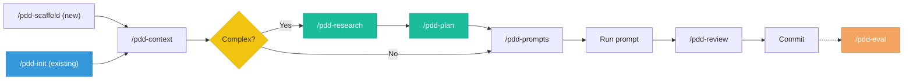

# PDD Skill for Google Antigravity

The same Prompt Driven Development workflows, adapted for Google Antigravity (the agentic IDE Google launched in November 2025).

Parts of this document are generated from shared metadata so provider terminology stays aligned.

## Setup

From the repo root, copy these files into your project:

```bash
# Copy the workspace rules (always-on)
cp providers/antigravity/GEMINI.md <your-project>/GEMINI.md

# Copy the skill entrypoint
mkdir -p <your-project>/.agents/skills/pdd
cp providers/antigravity/skills/pdd/SKILL.md <your-project>/.agents/skills/pdd/SKILL.md

# Copy the workflow files
mkdir -p <your-project>/.agent/workflows
cp providers/antigravity/workflows/*.md <your-project>/.agent/workflows/

# Copy the reference files (project type flavors)
mkdir -p <your-project>/.agent/references
cp -r core/references/* <your-project>/.agent/references/
```

Your project should end up with:

```
GEMINI.md
.agents/skills/pdd/SKILL.md
.agent/workflows/
  pdd-scaffold.md
  pdd-init.md
  pdd-context.md
  pdd-research.md
  pdd-plan.md
  pdd-prompts.md
  pdd-update.md
  pdd-review.md
  pdd-eval.md
  pdd-status.md
  pdd-help.md
.agent/references/
  frontend.md
  backend.md
  mobile.md
  data-ml.md
  devops.md
  fullstack.md
  library.md
  cli-devtools.md
  embedded-iot.md
  game-dev.md
  blockchain.md
  security.md
  api-platform.md
  desktop-gui.md
  compiler-lang.md
  robotics.md
```

## Usage

In Antigravity (CLI or IDE), the workflow files auto-expose as slash commands. Type `/` to see them, then select one:

<!-- GENERATED:antigravity-command-table:start -->
| Command | What it does |
|---|---|
| `/pdd-scaffold` | Set up a new PDD project with folders, context stubs, and starter guidance. |
| `/pdd-init` | Add PDD structure to an existing repository and infer a starting context. |
| `/pdd-context` | Write or update the persistent project context files that future prompts depend on. |
| `/pdd-research` | Explore the problem space, evaluate options, and decide what to build. |
| `/pdd-plan` | Break a feature into phases and decide the prompt chain strategy before coding. |
| `/pdd-prompts` | Generate focused feature prompts and place them in the right PDD folder. |
| `/pdd-update` | Diagnose and improve a prompt that is producing weak or incorrect output. |
| `/pdd-review` | Verify and review AI-generated output before it is committed. |
| `/pdd-eval` | Track prompt quality over time with repeatable evaluation criteria. |
| `/pdd-status` | Check what PDD artifacts exist, what is stale, and what to do next. |
| `/pdd-help` | Show the available workflows, when to use them, and the typical sequence. |
<!-- GENERATED:antigravity-command-table:end -->

The `GEMINI.md` workspace rules file loads automatically each session, providing PDD-aware routing and core principles.

## Workflow



**Quick path**: `/pdd-context` → `/pdd-prompts` → `/pdd-review` → commit. Use `/pdd-init` instead of `/pdd-scaffold` for existing projects. Add `/pdd-research` and `/pdd-plan` for complex features. Use `/pdd-eval` to track prompt reliability over time.

Each workflow file suggests the next step at the end, so you don't need to memorize the flow.

## Differences from the other adapters

| Aspect | Claude / Copilot / Codex | Antigravity |
|---|---|---|
| Workspace rules filename | `CLAUDE.md` / `.github/copilot-instructions.md` / `AGENTS.md` | `GEMINI.md` (Antigravity-specific to avoid `AGENTS.md` collisions with other tools) |
| File-reference syntax in prompts | `#file:references/foo.md` (Copilot) or plain prose (Claude) | Plain prose only — Antigravity has no documented `#file:` equivalent |
| Subagent definitions | Static persona files (Claude `.claude/agents/`, Copilot `.github/agents/`) | Not user-declarable; the orchestrator spawns subagents dynamically at runtime |
| Plugin manifest | `plugin.json` (Claude) / `.codex-plugin/plugin.json` (Codex) | Skipped for v1 — Antigravity's plugin schema is not publicly documented |

## Requirements

- Google Antigravity, CLI or IDE (public preview, November 2025+)
- A Gemini-compatible config directory (`~/.gemini/`) for any global skills or MCP servers you also want to install
